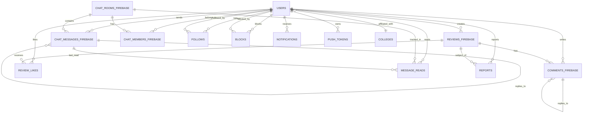

# Database Schema Documentation

## Overview

This document provides comprehensive documentation for the LockerRoom application database schema. The database is built on PostgreSQL with Supabase and includes advanced features like Row Level Security (RLS), real-time subscriptions, and comprehensive business logic implemented through functions and triggers.

## Table of Contents

- [Schema Overview](#schema-overview)
- [Core Tables](#core-tables)
- [Relationship Tables](#relationship-tables)
- [System Tables](#system-tables)
- [Row Level Security](#row-level-security)
- [Functions and Triggers](#functions-and-triggers)
- [Indexes and Performance](#indexes-and-performance)
- [Migration Guide](#migration-guide)
- [API Compatibility](#api-compatibility)
- [Troubleshooting](#troubleshooting)

## Schema Overview

The LockerRoom database schema is designed around social interaction, content sharing, and real-time communication. The schema follows these design principles:

- **Normalized structure** with clear separation of concerns
- **Comprehensive referential integrity** with foreign key constraints
- **Performance-optimized** with strategic indexing
- **Security-first** with Row Level Security on all user-facing tables
- **Real-time ready** with change tracking and pub/sub capabilities
- **Scalable** with efficient query patterns and caching strategies

### Entity Relationship Diagram



## Core Tables

### users

The central table for user profiles and authentication data.

```sql
CREATE TABLE users (
  id UUID PRIMARY KEY DEFAULT uuid_generate_v4(),
  anonymous_id TEXT,
  ban_reason TEXT,
  city TEXT,
  clerk_user_id TEXT,
  created_at TIMESTAMPTZ DEFAULT NOW(),
  email TEXT,
  gender TEXT,
  gender_preference TEXT DEFAULT 'all',
  institution_type TEXT,
  is_banned BOOLEAN DEFAULT FALSE,
  is_blocked BOOLEAN DEFAULT FALSE,
  last_active TIMESTAMPTZ,
  latitude DOUBLE PRECISION,
  longitude DOUBLE PRECISION,
  location_address TEXT,
  location_full_name TEXT,
  location_name TEXT,
  location_type TEXT,
  location_updated_at TIMESTAMPTZ,
  reputation_score INTEGER DEFAULT 0,
  state TEXT,
  subscription_expires_at TIMESTAMPTZ,
  subscription_tier TEXT DEFAULT 'free',
  total_reviews_submitted INTEGER DEFAULT 0,
  updated_at TIMESTAMPTZ DEFAULT NOW(),
  username TEXT,
  verification_level TEXT DEFAULT 'unverified',
  college_id UUID REFERENCES colleges(id),
  follower_count INTEGER DEFAULT 0,
  following_count INTEGER DEFAULT 0,
  privacy_settings JSONB DEFAULT '{"profile_visible": true, "location_visible": true}'::jsonb
);
```

**Key Features:**

- Supports both authenticated and anonymous users
- Location data with coordinates and address information
- Subscription and verification status tracking
- Cached follower/following counts for performance
- Privacy settings in JSON format
- College affiliation support

### reviews_firebase

Main table for user-generated reviews and content.

```sql
CREATE TABLE reviews_firebase (
  id UUID PRIMARY KEY DEFAULT uuid_generate_v4(),
  author_id UUID REFERENCES users(id) ON DELETE SET NULL,
  category TEXT,
  created_at TIMESTAMPTZ DEFAULT NOW(),
  dislike_count INTEGER DEFAULT 0,
  green_flags TEXT[],
  is_anonymous BOOLEAN DEFAULT FALSE,
  like_count INTEGER DEFAULT 0,
  location TEXT,
  media JSONB,
  profile_photo TEXT NOT NULL,
  red_flags TEXT[],
  review_text TEXT NOT NULL,
  reviewed_person_location JSONB NOT NULL,
  reviewed_person_name TEXT NOT NULL,
  reviewer_anonymous_id TEXT NOT NULL,
  sentiment TEXT,
  social_media JSONB,
  status TEXT DEFAULT 'active',
  updated_at TIMESTAMPTZ DEFAULT NOW()
);
```

**Key Features:**

- Support for anonymous reviews
- Rich media attachments via JSONB
- Location-based content with coordinates
- Flag system (green_flags, red_flags)
- Cached like/dislike counts
- Content moderation status tracking

### chat_rooms_firebase

Definition table for chat rooms and their properties.

```sql
CREATE TABLE chat_rooms_firebase (
  id UUID PRIMARY KEY DEFAULT uuid_generate_v4(),
  category TEXT,
  created_at TIMESTAMPTZ DEFAULT NOW(),
  created_by UUID REFERENCES users(id) ON DELETE SET NULL,
  description TEXT NOT NULL,
  is_active BOOLEAN DEFAULT TRUE,
  is_deleted BOOLEAN DEFAULT FALSE,
  is_private BOOLEAN DEFAULT FALSE,
  last_activity TIMESTAMPTZ DEFAULT NOW(),
  last_message JSONB,
  location JSONB,
  member_count INTEGER DEFAULT 0,
  name TEXT NOT NULL,
  online_count INTEGER DEFAULT 0,
  type TEXT NOT NULL,
  typing_users JSONB DEFAULT '[]'::jsonb,
  unread_count INTEGER DEFAULT 0,
  updated_at TIMESTAMPTZ DEFAULT NOW()
);
```

**Key Features:**

- Public and private room support
- Location-based rooms with coordinates
- Real-time member and online counts
- Typing indicator support
- Cached last message for efficiency
- Soft deletion support

### chat_messages_firebase

Individual messages within chat rooms.

```sql
CREATE TABLE chat_messages_firebase (
  id UUID PRIMARY KEY DEFAULT uuid_generate_v4(),
  chat_room_id UUID REFERENCES chat_rooms_firebase(id) ON DELETE CASCADE,
  content TEXT NOT NULL,
  is_deleted BOOLEAN DEFAULT FALSE,
  is_read BOOLEAN DEFAULT FALSE,
  message_type TEXT DEFAULT 'text',
  reactions JSONB DEFAULT '{}'::jsonb,
  reply_to UUID REFERENCES chat_messages_firebase(id) ON DELETE SET NULL,
  sender_avatar TEXT,
  sender_id UUID REFERENCES users(id) ON DELETE SET NULL,
  sender_name TEXT NOT NULL,
  timestamp TIMESTAMPTZ DEFAULT NOW()
);
```

**Key Features:**

- Support for multiple message types (text, image, voice, etc.)
- Message reactions system
- Reply threading support
- Read status tracking
- Soft deletion with content preservation

## Relationship Tables

### chat_members_firebase

Manages membership in chat rooms with roles and permissions.

```sql
CREATE TABLE chat_members_firebase (
  id UUID PRIMARY KEY DEFAULT uuid_generate_v4(),
  chat_room_id UUID NOT NULL REFERENCES chat_rooms_firebase(id) ON DELETE CASCADE,
  user_id UUID NOT NULL REFERENCES users(id) ON DELETE CASCADE,
  role TEXT DEFAULT 'member' CHECK (role IN ('admin', 'moderator', 'member')),
  joined_at TIMESTAMPTZ DEFAULT NOW(),
  is_active BOOLEAN DEFAULT TRUE,
  permissions JSONB DEFAULT '{"can_send_messages": true, "can_send_media": true}'::jsonb,
  created_at TIMESTAMPTZ DEFAULT NOW(),
  updated_at TIMESTAMPTZ DEFAULT NOW(),
  UNIQUE(chat_room_id, user_id)
);
```

**Key Features:**

- Role-based access control (admin, moderator, member)
- Granular permissions system via JSONB
- Active membership tracking
- Join timestamp for analytics

### follows

User following relationships for social networking.

```sql
CREATE TABLE follows (
  id UUID PRIMARY KEY DEFAULT uuid_generate_v4(),
  follower_id UUID NOT NULL REFERENCES users(id) ON DELETE CASCADE,
  following_id UUID NOT NULL REFERENCES users(id) ON DELETE CASCADE,
  created_at TIMESTAMPTZ DEFAULT NOW(),
  UNIQUE(follower_id, following_id),
  CHECK (follower_id != following_id)
);
```

**Key Features:**

- Bidirectional relationship tracking
- Self-follow prevention
- Automatic count updates via triggers
- Notification generation on follow

### blocks

User blocking relationships for safety and moderation.

```sql
CREATE TABLE blocks (
  id UUID PRIMARY KEY DEFAULT uuid_generate_v4(),
  blocker_id UUID NOT NULL REFERENCES users(id) ON DELETE CASCADE,
  blocked_id UUID NOT NULL REFERENCES users(id) ON DELETE CASCADE,
  reason TEXT,
  created_at TIMESTAMPTZ DEFAULT NOW(),
  UNIQUE(blocker_id, blocked_id),
  CHECK (blocker_id != blocked_id)
);
```

**Key Features:**

- Optional reason tracking
- Automatic relationship cleanup (removes follows)
- RLS policy integration for content filtering
- Self-block prevention

### review_likes

Tracks which users have liked which reviews.

```sql
CREATE TABLE review_likes (
  id UUID PRIMARY KEY DEFAULT uuid_generate_v4(),
  review_id UUID NOT NULL REFERENCES reviews_firebase(id) ON DELETE CASCADE,
  user_id UUID NOT NULL REFERENCES users(id) ON DELETE CASCADE,
  created_at TIMESTAMPTZ DEFAULT NOW(),
  UNIQUE(review_id, user_id)
);
```

**Key Features:**

- Duplicate like prevention
- Automatic count updates on reviews
- Notification generation
- Blocking-aware constraints

### message_reads

Tracks read status of messages by users in chat rooms.

```sql
CREATE TABLE message_reads (
  id UUID PRIMARY KEY DEFAULT uuid_generate_v4(),
  room_id UUID NOT NULL REFERENCES chat_rooms_firebase(id) ON DELETE CASCADE,
  user_id UUID NOT NULL REFERENCES users(id) ON DELETE CASCADE,
  last_read_at TIMESTAMPTZ DEFAULT NOW(),
  last_message_id UUID REFERENCES chat_messages_firebase(id) ON DELETE SET NULL,
  created_at TIMESTAMPTZ DEFAULT NOW(),
  updated_at TIMESTAMPTZ DEFAULT NOW(),
  UNIQUE(room_id, user_id)
);
```

**Key Features:**

- Per-room read tracking
- Timestamp and message ID tracking
- Unread count calculation support
- Real-time synchronization

### colleges

Master list of educational institutions.

```sql
CREATE TABLE colleges (
  id UUID PRIMARY KEY DEFAULT uuid_generate_v4(),
  name TEXT NOT NULL,
  city TEXT,
  state TEXT,
  coordinates JSONB, -- {"lat": number, "lng": number}
  institution_type TEXT CHECK (institution_type IN ('public', 'private', 'community', 'technical', 'other')),
  alias TEXT[], -- Alternative names and abbreviations
  scorecard_id TEXT, -- Department of Education ID
  website_url TEXT,
  student_count INTEGER,
  founded_year INTEGER,
  is_active BOOLEAN DEFAULT TRUE,
  created_at TIMESTAMPTZ DEFAULT NOW(),
  updated_at TIMESTAMPTZ DEFAULT NOW()
);
```

**Key Features:**

- Comprehensive institution data
- Geographic coordinates
- Multiple name aliases support
- Department of Education integration
- Search optimization

## System Tables

### notifications

Push notification and alert system.

```sql
CREATE TABLE notifications (
  id UUID PRIMARY KEY DEFAULT uuid_generate_v4(),
  body TEXT NOT NULL,
  created_at TIMESTAMPTZ DEFAULT NOW(),
  data JSONB,
  expo_push_token TEXT,
  is_read BOOLEAN DEFAULT FALSE,
  is_sent BOOLEAN DEFAULT FALSE,
  title TEXT NOT NULL,
  type TEXT NOT NULL,
  user_id UUID NOT NULL REFERENCES users(id) ON DELETE CASCADE
);
```

### push_tokens

Device-specific push notification tokens.

```sql
CREATE TABLE push_tokens (
  id UUID PRIMARY KEY DEFAULT uuid_generate_v4(),
  created_at TIMESTAMPTZ DEFAULT NOW(),
  device_id TEXT NOT NULL,
  is_active BOOLEAN DEFAULT TRUE,
  platform TEXT NOT NULL,
  token TEXT NOT NULL,
  updated_at TIMESTAMPTZ DEFAULT NOW(),
  user_id UUID NOT NULL REFERENCES users(id) ON DELETE CASCADE,
  UNIQUE(user_id, device_id)
);
```

### reports

Content reporting and moderation system.

```sql
CREATE TABLE reports (
  id UUID PRIMARY KEY DEFAULT uuid_generate_v4(),
  created_at TIMESTAMPTZ DEFAULT NOW(),
  description TEXT,
  reason TEXT NOT NULL,
  reported_item_id TEXT NOT NULL,
  reported_item_type TEXT NOT NULL,
  reporter_id UUID NOT NULL REFERENCES users(id) ON DELETE CASCADE,
  status TEXT DEFAULT 'pending',
  updated_at TIMESTAMPTZ DEFAULT NOW()
);
```

## Row Level Security

All tables have RLS enabled with comprehensive policies that handle:

### Security Model

- **Authentication-based access**: Most operations require `auth.uid()` to be set
- **Ownership patterns**: Users can modify their own content
- **Blocking awareness**: Content from blocked users is filtered
- **Role-based access**: Chat room roles determine permissions
- **Privacy settings**: User privacy preferences are respected

### Key Policies

#### Users Table

```sql
-- Users can view non-blocked profiles
CREATE POLICY "Users can view non-blocked profiles" ON users
  FOR SELECT USING (
    NOT EXISTS (
      SELECT 1 FROM blocks b
      WHERE (b.blocker_id = users.id AND b.blocked_id = auth.uid())
      OR (b.blocker_id = auth.uid() AND b.blocked_id = users.id)
    )
  );

-- Users can update their own profile
CREATE POLICY "Users can update own profile" ON users
  FOR UPDATE USING (auth.uid() = id);
```

#### Chat Members

```sql
-- Users can view members of rooms they belong to
CREATE POLICY "Users can view chat members" ON chat_members_firebase
  FOR SELECT USING (
    auth.uid() = user_id OR
    EXISTS (
      SELECT 1 FROM chat_members_firebase cm2
      WHERE cm2.chat_room_id = chat_members_firebase.chat_room_id
      AND cm2.user_id = auth.uid()
      AND cm2.is_active = true
    )
  );
```

#### Content Filtering

All content policies include blocking awareness:

```sql
-- Reviews are filtered by blocking relationships
CREATE POLICY "Users can view non-blocked reviews" ON reviews_firebase
  FOR SELECT USING (
    (status = 'active' OR status IS NULL) AND
    NOT EXISTS (
      SELECT 1 FROM blocks b
      WHERE (b.blocker_id = author_id AND b.blocked_id = auth.uid())
      OR (b.blocker_id = auth.uid() AND b.blocked_id = author_id)
    )
  );
```

## Functions and Triggers

### Core Business Logic Functions

#### Chat Room Management

```sql
-- Add user to chat room with role validation
add_user_to_chat_room(room_id UUID, user_id UUID, role TEXT)

-- Remove user from chat room with cleanup
remove_user_from_chat_room(room_id UUID, user_id UUID)

-- Check membership status
is_user_room_member(room_id UUID, user_id UUID) RETURNS BOOLEAN

-- Get user role in room
get_user_room_role(room_id UUID, user_id UUID) RETURNS TEXT
```

#### Social Features

```sql
-- Follow/unfollow with blocking checks
follow_user(follower_id UUID, following_id UUID) RETURNS BOOLEAN
unfollow_user(follower_id UUID, following_id UUID) RETURNS BOOLEAN

-- Block/unblock with relationship cleanup
block_user(blocker_id UUID, blocked_id UUID, reason TEXT) RETURNS BOOLEAN
unblock_user(blocker_id UUID, blocked_id UUID) RETURNS BOOLEAN

-- Like/unlike reviews with count updates
toggle_review_like(review_id UUID, user_id UUID) RETURNS BOOLEAN
```

#### Message Tracking

```sql
-- Mark messages as read with timestamp updates
mark_messages_read(room_id UUID, user_id UUID, last_message_id UUID)

-- Get unread message counts
get_unread_message_count(room_id UUID, user_id UUID) RETURNS INTEGER
get_user_unread_counts(user_id UUID) -- Returns table
```

### Automatic Triggers

#### Count Updates

- **Follow counts**: Automatically updated when follows are added/removed
- **Review like counts**: Updated when likes are added/removed
- **Chat member counts**: Updated when members join/leave rooms
- **Review counts**: Updated when reviews are created/deleted

#### Notifications

- **Follow notifications**: Created when user gains a follower
- **Like notifications**: Created when review receives a like
- **Mention notifications**: Created when user is mentioned in comments

#### Timestamp Management

- **updated_at triggers**: Automatically update modified timestamps
- **Activity tracking**: Update user last_active on interactions

## Indexes and Performance

### Strategic Indexing

The schema includes comprehensive indexes for optimal query performance:

```sql
-- User lookup and authentication
CREATE INDEX idx_users_email ON users(email);
CREATE INDEX idx_users_clerk_user_id ON users(clerk_user_id);

-- Social graph queries
CREATE INDEX idx_follows_follower_id ON follows(follower_id);
CREATE INDEX idx_follows_following_id ON follows(following_id);

-- Content discovery
CREATE INDEX idx_reviews_firebase_created_at ON reviews_firebase(created_at DESC);
CREATE INDEX idx_reviews_firebase_category ON reviews_firebase(category);
CREATE INDEX idx_reviews_firebase_like_count ON reviews_firebase(like_count DESC);

-- Chat performance
CREATE INDEX idx_chat_messages_firebase_chat_room_id ON chat_messages_firebase(chat_room_id);
CREATE INDEX idx_chat_messages_firebase_timestamp ON chat_messages_firebase(timestamp DESC);
CREATE INDEX idx_chat_members_room_active ON chat_members_firebase(chat_room_id, is_active) WHERE is_active = true;

-- Real-time features
CREATE INDEX idx_message_reads_room_id ON message_reads(room_id);
CREATE INDEX idx_message_reads_user_id ON message_reads(user_id);
```

### Query Optimization Tips

1. **Use covering indexes** for frequently accessed column combinations
2. **Filter by active status** first in multi-table queries
3. **Leverage cached counts** instead of computing aggregates
4. **Use LIMIT** on large result sets
5. **Consider pagination** for infinite scroll features

## Migration Guide

### Running Migrations

1. **Complete Database Restore** (`20250911000000_complete_database_restore.sql`)
   - Creates all core tables and basic structure
   - Enables RLS on all tables
   - Creates indexes and constraints

2. **RLS Policies** (`20250911000001_create_rls_policies.sql`)
   - Implements comprehensive security policies
   - Handles blocking relationships
   - Sets up role-based access

3. **Functions and Triggers** (`20250911000003_create_functions_and_triggers.sql`)
   - Creates business logic functions
   - Sets up automatic triggers
   - Implements notification system

4. **Missing Tables** (`20250911000004_add_missing_tables_and_relationships.sql`)
   - Adds relationship tables (follows, blocks, etc.)
   - Creates college data with seed values
   - Establishes all foreign key relationships

### Migration Order

```bash
# Apply migrations in order
psql -f supabase/migrations/20250911000000_complete_database_restore.sql
psql -f supabase/migrations/20250911000001_create_rls_policies.sql
psql -f supabase/migrations/20250911000003_create_functions_and_triggers.sql
psql -f supabase/migrations/20250911000004_add_missing_tables_and_relationships.sql
```

### Validation

```bash
# Run validation script
node scripts/validate-database-schema.js
```

## API Compatibility

### Supabase v2.57.4 Features

The schema is fully compatible with Supabase v2.57.4 and leverages:

- **Real-time subscriptions** with postgres_changes
- **Row Level Security** with policy-based access control
- **JSON/JSONB** for flexible data structures
- **Full-text search** capabilities
- **Geographic queries** with PostGIS
- **Triggers and functions** for business logic

### Service Integration

#### Chat Service (`chat.ts`)

```javascript
// Room membership queries
await supabase
  .from("chat_members_firebase")
  .select("*, users(username)")
  .eq("chat_room_id", roomId)
  .eq("is_active", true);

// Message read tracking
await supabase.rpc("mark_messages_read", {
  p_room_id: roomId,
  p_user_id: userId,
  p_last_message_id: messageId,
});
```

#### Users Service (`users.ts`)

```javascript
// Follow user
await supabase.rpc("follow_user", {
  p_follower_id: currentUserId,
  p_following_id: targetUserId,
});

// Block user
await supabase.rpc("block_user", {
  p_blocker_id: currentUserId,
  p_blocked_id: targetUserId,
  p_reason: "inappropriate_behavior",
});
```

#### Reviews Service (`reviews.ts`)

```javascript
// Like review
await supabase.rpc("toggle_review_like", {
  p_review_id: reviewId,
  p_user_id: userId,
});

// Get user's liked reviews
await supabase.rpc("get_user_liked_reviews", {
  p_user_id: userId,
  p_limit: 20,
});
```

### Real-time Integration

```javascript
// Subscribe to chat messages with RLS
const channel = supabase
  .channel(`room:${roomId}`)
  .on(
    "postgres_changes",
    {
      event: "INSERT",
      schema: "public",
      table: "chat_messages_firebase",
      filter: `chat_room_id=eq.${roomId}`,
    },
    handleNewMessage,
  )
  .subscribe();

// Subscribe to follow notifications
const followChannel = supabase
  .channel("user-follows")
  .on(
    "postgres_changes",
    {
      event: "INSERT",
      schema: "public",
      table: "follows",
      filter: `following_id=eq.${userId}`,
    },
    handleNewFollower,
  )
  .subscribe();
```

## Troubleshooting

### Common Issues

#### RLS Policy Debugging

```sql
-- Check if RLS is enabled
SELECT schemaname, tablename, rowsecurity
FROM pg_tables
WHERE schemaname = 'public' AND rowsecurity = true;

-- View policies for a table
SELECT * FROM pg_policies WHERE tablename = 'users';
```

#### Performance Issues

```sql
-- Check slow queries
SELECT query, mean_exec_time, calls
FROM pg_stat_statements
ORDER BY mean_exec_time DESC;

-- Analyze table statistics
ANALYZE users;
EXPLAIN (ANALYZE, BUFFERS) SELECT * FROM users WHERE email = 'test@example.com';
```

#### Foreign Key Constraint Errors

```sql
-- Check constraint violations
SELECT
  tc.table_name,
  tc.constraint_name,
  tc.constraint_type
FROM information_schema.table_constraints tc
WHERE tc.constraint_type = 'FOREIGN KEY'
AND tc.table_schema = 'public';
```

### Data Integrity Checks

```sql
-- Check for orphaned records
SELECT COUNT(*) FROM reviews_firebase r
LEFT JOIN users u ON r.author_id = u.id
WHERE r.author_id IS NOT NULL AND u.id IS NULL;

-- Verify follow count accuracy
SELECT
  u.id,
  u.follower_count,
  (SELECT COUNT(*) FROM follows WHERE following_id = u.id) as actual_followers
FROM users u
WHERE u.follower_count != (SELECT COUNT(*) FROM follows WHERE following_id = u.id);
```

### Maintenance Tasks

```sql
-- Clean up old notifications
SELECT cleanup_old_notifications(30); -- Remove notifications older than 30 days

-- Update user statistics
SELECT get_user_stats(user_id) FROM users;

-- Rebuild indexes if needed
REINDEX TABLE users;
```

### Monitoring Queries

```sql
-- Active connections by table
SELECT
  schemaname,
  tablename,
  n_tup_ins as inserts,
  n_tup_upd as updates,
  n_tup_del as deletes
FROM pg_stat_user_tables
WHERE schemaname = 'public'
ORDER BY n_tup_ins + n_tup_upd + n_tup_del DESC;

-- Real-time subscription health
SELECT
  application_name,
  state,
  query
FROM pg_stat_activity
WHERE application_name LIKE '%supabase%';
```

---

This documentation should be updated whenever the schema changes. For questions or issues, refer to the validation script output or check the migration files for the most current implementation details.
